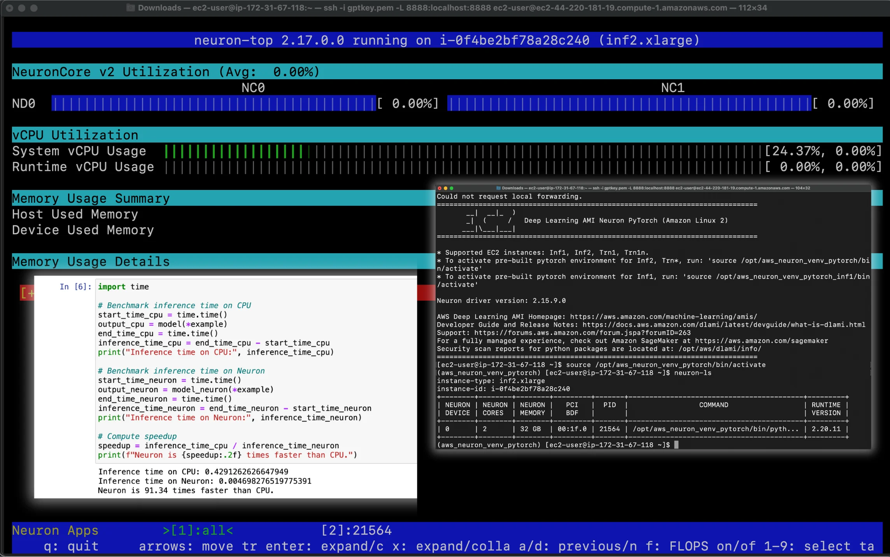

<h1 align="center">High Performance Text Analysis with HuggingFace GPT-2 on AWS Neuron with AWS Inferentia</h1>

<p align="center">
  <a href="www.cloudacademy.com">
    
  </a>
</p>

Welcome to this repository dedicated to utilizing the `AWS Deep Learning AMI` with the `Neuron SDK` and `PyTorch` on `AWS Inferentia` to compile and execute the `HuggingFace GPT-2` model.

The HuggingFace Pretrained GPT-2 model, developed in the PyTorch framework, generates coherent and contextually relevant text. Our focus on feature extraction demonstrates how the GPT-2 model processes input text, converting it into numerical features. This capability is essential for advanced text analysis tasks, utilizing AWS Inferentia to accelerate deep learning inference. This approach enhances the speed and efficiency of text analysis, setting the stage for a variety of applications, from sentiment analysis to automated content generation.

>  This repository provides a brief overview of the key concepts and steps involved for conducting high-performance text analysis using the HuggingFace GPT-2 model on AWS Neuron. It covers key steps to compile and execute GPT-2 for optimized inference on AWS Inferentia chips.  Please note, this repo is designed to be used in conjunction with our lesson @ Cloud Academy. It contains essential Python scripts and additional resources that are necessary for following along with the demo. 

## Prerequisites
- AWS CLI.
- EC2 Inf Instances with at least 4 vCPUs available.

## Request Service Quota Increase

Before setting up the deep learning environment on AWS, follow these initial steps:

- Confirm you have the necessary service quota to launch an `inf2.xlarge` instance.

- If not, request a service quota increase for EC2 Inf instances ensuring you have at least `4 vCPUs` available. 

## Launch Deep Learning AMI

Set up the AWS environment by launching the appropriate Deep Learning AMI:

- Launch the `Deep Learning AMI Neuron PyTorch (Amazon Linux 2)` in the `us-east-1` region. For detailed information, refer to the [AWS Release Notes](https://aws.amazon.com/releasenotes/aws-deep-learning-ami-neuron-pytorch-1-13-amazon-linux-2/).

- To find the latest AMI-ID, execute the following command in your terminal or command prompt :

```bash
aws ec2 describe-images --region us-east-1 --owners amazon --filters 'Name=name,Values=Deep Learning AMI Neuron PyTorch 1.13 (Amazon Linux 2) ????????' 'Name=state,Values=available' --query 'reverse(sort_by(Images, &CreationDate))[:1].ImageId' --output text
```

- With the AMI ID you've obtained, launch an EC2 `inf2.xlarge` instance,with a key pair for SSH access.

## Establish SSH Connection to the Inf2 Instance

- Use a terminal to establish a secure SSH connection to the `inf2` instance using the private key file (.pem) for authentication.

## Activate PyTorch Environment & Verify Dependencies

After establishing an SSH connection to the EC2 Inf2 instance, update system packages, activate the PyTorch Neuron environment, and verify key Python packages.

**a) Update System Packages:**

```bash
sudo yum update -y
```

**b) Activate PyTorch Neuron Environment:**

```bash
source /opt/aws_neuron_venv_pytorch/bin/activate
```

**c) Verify Installation of Key Packages:**

```bash
pip show torch-neuronx
pip show neuronx-cc
pip show transformers
```

These packages are pre-installed with the Deep Learning AMI by AWS.

**d) Update Neuron Compiler and PyTorch Library:**

```bash
python -m pip install --upgrade neuronx-cc==2.* torch-neuronx torchvision
```

## Launch & Access Jupyter Notebook via SSH Tunneling

Launch and access a Jupyter Notebook on your EC2 Inf2 instance powered by the Deep Learning AMI, using SSH tunneling for secure access.

**a) Verify Environment and Pre-installed Packages:**

- Check that Jupyter Notebook is installed:
  
  ```bash
  jupyter notebook --version
  ```
- Check that ipykernel is installed
  
  ```bash
  pip show ipykernel
  ```
These packages are also pre-installed with the Deep Learning AMI by AWS.


**b) Install Neuron-PyTorch Jupyter Kernel:**

- Install the `Neuron-PyTorch Jupyter Kernel` to leverage the AWS Neuron optimized PyTorch environment:

  ```bash
  python3.8 -m ipykernel install --user --name aws_neuron_venv_pytorch --display-name "Python (torch-neuronx)"
  ```

**c) Additional Configuration:**

- Install `environment_kernels` for environment management within Jupyter:

  ```bash
  pip install environment_kernels
  ```

- Set pip to target the Neuron repository for optimized packages:

  ```bash
  python -m pip config set global.extra-index-url https://pip.repos.neuron.amazonaws.com
  ```

**d) Start the Jupyter Notebook Server**

- Initiate the Jupyter Notebook server & create SSH Tunnel:

  ```bash
  jupyter notebook --no-browser --port=8888
  ```

- Create an SSH tunnel to securely forward local traffic to the EC2 Inf2 instance for Jupyter Notebook access:

  ```bash
  ssh -L 8888:localhost:8888 /path/key-pair.pem ec2-user@instance-public-dns
  ```

## Optimize and Deploy GPT-2 Models on AWS Neuron

This step outlines the process of setting up and optimizing a GPT-2 model for feature extraction using AWS Neuron, including initial setup, compilation into a Neuron-optimized TorchScript, and benchmarking performance gains on AWS Inferentia chips.

 > You can automate the optimization and deployment process by executing all three Python scripts from the GitHub repository in a single Jupyter notebook cell.

### a) Initial Setup

Some additional dependencies are required for compiling and running the HuggingFace transformers GPT2 model on Neuron:

- Create a new notebook within the Jupyter Notebook environment.
  - select the `Python (torch-neuronx)` kernel

- Set environment variables to suppress tokenizer warnings, facilitating easier error detection during text analysis:

  ```python
  %env TOKENIZERS_PARALLELISM=True
  ```

- Install additional dependencies for compatibility with the notebook tasks:

  ```bash
  !pip install "transformers<4.21.0"
  ```

### b) Setup and Imports

Begin your notebook with the necessary setup and imports:

```python
import torch
import torch_neuronx
from transformers import GPT2Tokenizer, GPT2Model
```

These imports provide the tools needed for model loading, feature extraction, and optimization on AWS Neuron.

### c) Create the Model Wrapper

To optimize the GPT-2 model for AWS Neuron and ensure it accepts inputs correctly, create a custom wrapper class:

```python
class GPT2Neuron(torch.nn.Module):
    def __init__(self, model) -> None:
        super().__init__()
        self.model = model

    def forward(self, input_ids, attention_mask):
        return self.model(input_ids=input_ids, attention_mask=attention_mask)
```

This wrapper allows the model to process inputs directly, facilitating the integration with Neuron SDK.

### d) Initialize the Tokenizer and Model

Load the GPT-2 tokenizer and model, prepare them for inference and optimization:

```python
tokenizer = GPT2Tokenizer.from_pretrained('gpt2')
tokenizer.pad_token = tokenizer.eos_token  # Sets the padding token
gpt2 = GPT2Model.from_pretrained('gpt2', torchscript=True)
model = GPT2Neuron(gpt2)
model.eval()
```

This initialization ensures consistent input sizes and optimizes the model for performance with AWS Neuron.

### e) Prepare the Example Input

Prepare your model for inference and optimization by encoding a sample text input:

```python
text = "Advance your tech career with Cloud Academy."
encoded_input = tokenizer(
    text,
    max_length=128,
    padding='max_length',
    truncation=True,
    return_tensors='pt'
)
example = (encoded_input['input_ids'], encoded_input['attention_mask'])
```

The encoded input converts text into a format processable by the model, ready for both inference and optimization on AWS Neuron.

### f) Inference and Model Compilation

Execute inference on the CPU with your prepared input to verify the model's functionality.

```python
# Run inference on CPU
output_cpu = model(*example)

# Compile the model using the wrapper
model_neuron = torch_neuronx.trace(model, example)
```

- Execute `neuron-top` in the terminal to closely observe AWS Inferentia chips' utilization.

- Allow `neuron-top` to operate in the background to monitor the real-time resource usage while your model undergoes compilation through AWS Neuron. This insight helps confirm the effective utilization of Inferentia chips during model optimization.

### g) Save the Compiled Model

After compilation, save the model as a TorchScript file, facilitating straightforward deployment. This AWS Neuron-optimized model file enables efficient inference when loaded in future instances:

```python
filename = 'model.pt'
torch.jit.save(model_neuron, filename)
```

### h) Compare Inference and Results

After optimizing your GPT-2 model for AWS Neuron, assess its performance and ensure the outputs between the CPU and Neuron-optimized versions remain consistent. This comparison confirms that the optimization process preserves the model's accuracy and functionality.

```python
# Load the TorchScript compiled model
model_neuron = torch.jit.load(filename)

# Perform inference using the Neuron-optimized model
output_neuron = model_neuron(*example)

# Display the results for comparison
print(f"CPU outputs:    {output_cpu[0][0][0][:10]}")
print(f"Neuron outputs: {output_neuron[0][0][0][:10]}")
```

This validation step demonstrates that AWS Neuron optimization maintains model accuracy while enhancing inference efficiency and lowering computational costs.

### I) Measure Inference Time

To quantify the performance benefits of AWS Neuron optimization, compare the inference times between the CPU and Neuron-optimized model. This comparison highlights the efficiency gains achievable with AWS Neuron.

```python
import time

# Benchmark inference time on CPU
start_time_cpu = time.time()
output_cpu = model(*example)
end_time_cpu = time.time()
inference_time_cpu = end_time_cpu - start_time_cpu
print("Inference time on CPU:", inference_time_cpu)

# Benchmark inference time on Neuron
start_time_neuron = time.time()
output_neuron = model_neuron(*example)
end_time_neuron = time.time()
inference_time_neuron = end_time_neuron - start_time_neuron
print("Inference time on Neuron:", inference_time_neuron)

# Compute speedup
speedup = inference_time_cpu / inference_time_neuron
print(f"Neuron is {speedup:.2f} times faster than CPU.")
```

This analysis shows that the optimization significantly reduces inference time, providing substantial performance improvements in deployment environments.

### J) Verify AWS Inferentia Utilization

Ensure your deployment efficiently uses AWS Inferentia chips for accelerated performance:

```bash
neuron-ls
```

Observing your model's PID in the `neuron-ls` output confirms it is leveraging the AWS Neuron device for inference, indicating successful utilization of specialized hardware for enhanced performance.